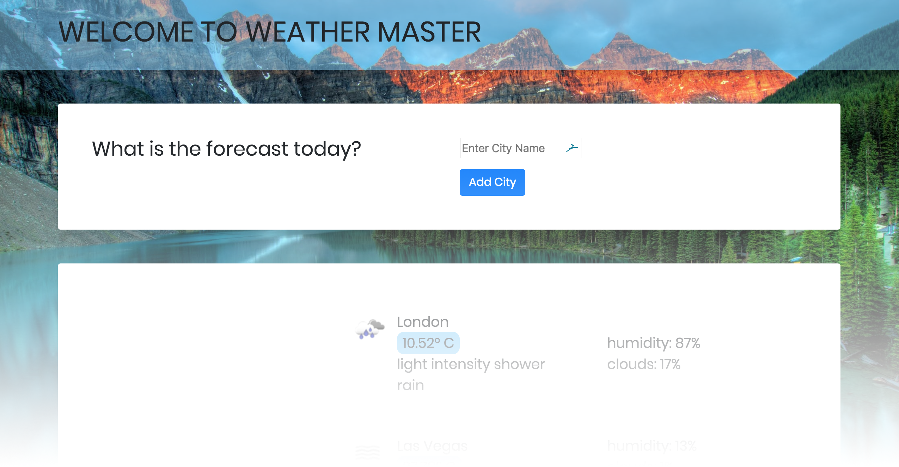
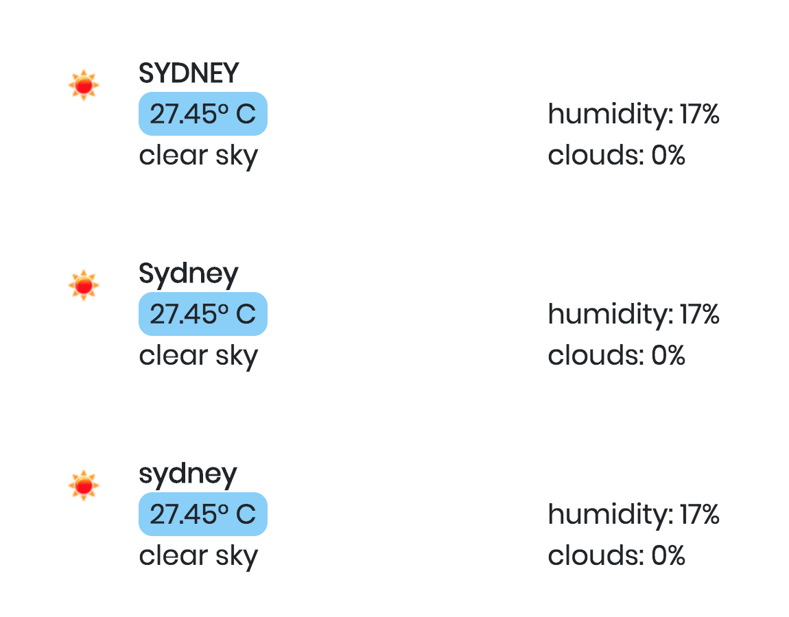

# WEATHER MASTER




## Flask API Assignment for Coder Academy 

The Weather Master App utilises an algorithm that allows two-way communication to take place between both the application and the Open Weather Map API and a web browser and the application. The Weather Master presents a web page with an input where a user can type in a city. By clicking on the "Add City" button, the city is added to a database and then a request is made to the Open Weather Map API. The API returns the temperature, a brief description of the weather, a weather icon, humidity reading and cloud coverage reading. Using the bootstrap framework, this data is organised into two columns for clean display.  Error handling has been implemented where duplicate cities cannot be added and only valid cities will be accepted by the input.


## Dependencies

- Flask
- Requests
- OS
- Python-dotenv
- SQLAlchemy
- Flake8


## Pylint vs Flake 8

When running `app.py` through Pylint, you will receive the following errors in your terminal:

```bash
app.py:30:9: E1101: Instance of 'SQLAlchemy' has no 'Column' member (no-member)
app.py:30:19: E1101: Instance of 'SQLAlchemy' has no 'Integer' member (no-member)
app.py:31:11: E1101: Instance of 'SQLAlchemy' has no 'Column' member (no-member)
app.py:31:21: E1101: Instance of 'SQLAlchemy' has no 'String' member (no-member)
app.py:28:0: R0903: Too few public methods (0/2) (too-few-public-methods)
app.py:45:12: E1101: Instance of 'scoped_session' has no 'add' member (no-member)
app.py:46:12: E1101: Instance of 'scoped_session' has no 'commit' member (no-member)
```

This is linked to using SQLAlchemy and is a known problem when using Pylint. 
More about the issue can be read about [here](https://github.com/PyCQA/pylint/issues/1973).

However, when using Flake 8, the errors do not appear. So if you decide to clone/fork this repo to enhance this project further, I recommend you use Flake 8 to check that your code is PEP8 standard. 

If you are a hardcore Pylint fan and refuse to use anything else because you loooove getting that sweet score feedback, then you can install a package called `pylint_flask_sqlalchemy` which omits those error messages as if they never existed. The docs are [here](https://pypi.org/project/pylint-flask-sqlalchemy/).


## SQLAlchemy tips for clearing database

If you wish to delete some of the cities from the database because it's getting too long, in your terminal type the following commands:

`sqlite3 weather.db`

This command gives you access to the database

`select * from city;`

This command allows you to access all the city entries

`delete from city where id = 5;`

This command allows you to delete a city by its ID

`.exit`

Exits the database


## To Work On Next

The following is what I would like to add/work on for V2.0

- The ability to delete cities from the page so the list doesn't become too long.

- Replace humidity/cloud reading with clothing recommendations.

- User input of cities isn't case sensitive!! 🤦🏽‍♀️ So duplicates can still happen if written in different cases....

  eg. 
  


## Key Takeaways

Learning Flask has been fun but quite challenging. I enjoyed the learning experience with this assignment and it has made me want to keep going and build other apps with more extensive APIs. Personally I still have a lot to learn and commit to memory but constant practice and coding will help with that. And also constant Googling like all good devs.

My main goal is to learn more about classes and get comfortable with them. 👍


## License

[](http://badges.mit-license.org/)

- **MIT license**

  ©️ Anne Homann 2019
